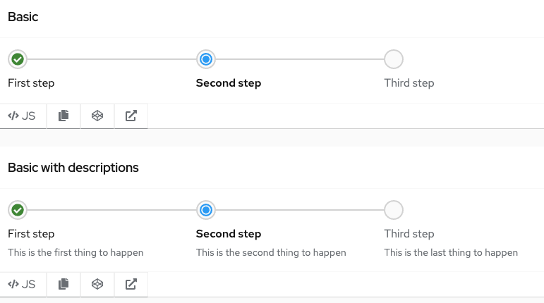
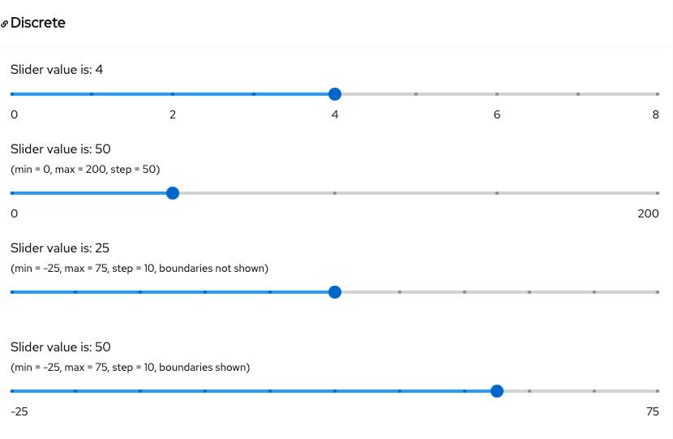
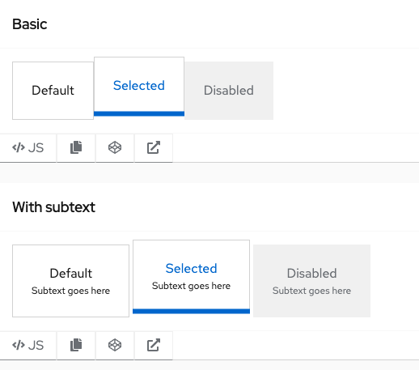

# PatternFly Beta Component Promotion Candidates
## For Release 2022.04

### Progress stepper
A progress stepper component communicates the progress made over a multi step process.

### Slider
A slider provides a quick and effective way for users to set and adjust a numeric value from a defined range of values.

### Tile
A tile is a form of selection that can be used in place of a radio button or checkbox and is commonly used in forms.

