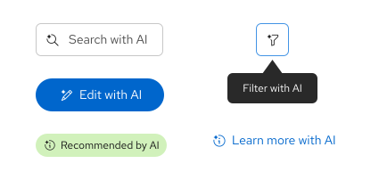
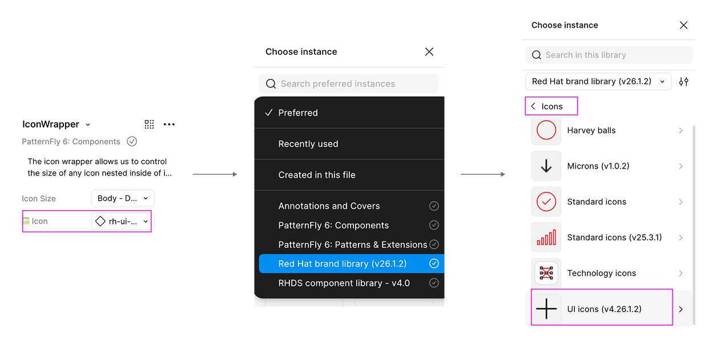
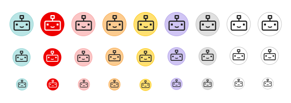
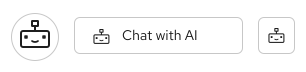

---
id: Design language
section: AI
sortValue: 2
--- 

import { Icon } from '@patternfly/react-core';
import RhUiAiCreateIcon from '@patternfly/react-icons/dist/esm/icons/rh-ui-ai-create-icon';
import RhUiAiEditIcon from '@patternfly/react-icons/dist/esm/icons/rh-ui-ai-edit-icon';
import RhUiAiEnhanceIcon from '@patternfly/react-icons/dist/esm/icons/rh-ui-ai-enhance-icon';
import RhUiAiErrorIcon from '@patternfly/react-icons/dist/esm/icons/rh-ui-ai-error-icon';
import RhUiAiExperienceFillIcon from '@patternfly/react-icons/dist/esm/icons/rh-ui-ai-experience-fill-icon';
import RhUiAiExperienceIcon from '@patternfly/react-icons/dist/esm/icons/rh-ui-ai-experience-icon';
import RhUiAiFilterIcon from '@patternfly/react-icons/dist/esm/icons/rh-ui-ai-filter-icon';
import RhUiAiInfoIcon from '@patternfly/react-icons/dist/esm/icons/rh-ui-ai-info-icon';
import RhUiAiSearchIcon from '@patternfly/react-icons/dist/esm/icons/rh-ui-ai-search-icon';
import RhUiAiTroubleshootIcon from '@patternfly/react-icons/dist/esm/icons/rh-ui-ai-troubleshoot-icon';
import '../components/components.css';

This guide outlines the design language that should guide the implementation and communication of AI-enabled features at Red Hat, inlcuding common design patterns to follow in your UIs. Many of the linked resources require a Red Hat login.

## Core principles 

1. **Be transparent:** Users want to know when they are interacting with AI, so use clear labels and visual cues.
2. **Make AI personable, but not human:** While AI should use a human-like voice and tone, it should never act as if it is a person.
3. **Stay within brand rules:** Adhere to [Red Hat brand standards](http://brand.redhat.com) and guidelines from both PatternFly and the [Red Hat design system ](http://ux.redhat.com).
4. **Complete internal reviews:** Follow all other required guidance and assessments for your products, such as an [AI Assessment (AIA)](https://source.redhat.com/departments/it/it_information_security/data_privacy/aia~2) or Privacy Impact Assessment.

## AI disclosure 

Ensure that AI is clearly marked in multiple ways, including at least 1 visual and 1 text indicator. For example, an AI-generated search feature should be indicated with an AI-search icon and a "Search with AI" text label. Higher-risk interactions benefit from additional indicators, like a text notice placed at the beginning of an experience. Consult with the AIA Reviewers during your AIA review process as needed.

To avoid adding more distraction to an experience, **do not** label AI-generated images or ads individually. Instead, consider implementing a site-wide notice that outlines when users will (and won’t) encounter AI-generated images.

Disclose any use of AI in chatbots, as outlined in our [ChatBot design guidelines](/extensions/chatbot/overview/design-guidelines). 

For more Red Hat-specific guidance AI disclosure, [refer to this guidance for tranparency notices in externally facing AI features (Red Had login required)](https://docs.google.com/document/d/1eVk8pMiSTqjfQSwU_h21BBXJ5PN8jbSLcU0wBtUt7bs/edit?tab=t.0#heading=h.dyq1r89dkf3e).

## Color 

**Do not** use unique colors or gradients to indicate AI features. 

To ensure accessibility and proper status communication, AI-related icons and elements should still use standard [PatternFly colors](/foundations-and-styles/color). For example, AI-action buttons should use the appropriate color token that aligns with the button variant, like primary, secondary, and so on.

## Iconography 

AI is represented by a sparkle icon, which is a diamond shape with concave sides. When the sparkle icon is added to the upper-left of another icon, it indicates an ai-enabled action or an action with an ai-generated result. For example, a sparkle placed beside a pencil icon indicates that a user can generate text with AI. 

AI icons **must** also be paired with a button label or tooltip text that says "[ Action ] with AI" or "[ Action ] by AI" to ensure there are multiple indicators that AI is being used. You can adapt this text label between tenses as appropriate. For example, "Search with AI" or "Search results generated by AI."

The following AI-enabled icons are available for use:

| **Icon** | **Name** | **React** | **Text label** | **Usage** |
| :---: | --- | --- | --- | --- |
| <Icon size="lg"><RhUiAiExperienceIcon /></Icon> | rh-ui-ai-experience-icon | RhUiAiExperienceIcon | | Use for general AI identification or when no other AI icon is appropriate. |
| <Icon size="lg"><RhUiAiExperienceFillIcon /></Icon> | rh-ui-ai-experience-fill-icon | RhUiAiExperienceFillIcon | | Use for general AI identification or when no other AI icon is appropriate. |
| <Icon size="lg"><RhUiAiCreateIcon /></Icon> | rh-ui-ai-create-icon | RhUiAiCreateIcon | "Create with AI" | Create something new with the help of AI. |
| <Icon size="lg"><RhUiAiEditIcon /></Icon> | rh-ui-ai-edit-icon | RhUiAiEditIcon | "Edit with AI" | Use to edit something with the help of AI. Typically used for editing text. |
| <Icon size="lg"><RhUiAiEnhanceIcon /></Icon> | rh-ui-ai-enhance-icon | RhUiAiEnhanceIcon | "Enhance with AI" | Use AI to enhance something. |
| <Icon size="lg"><RhUiAiErrorIcon /></Icon> | rh-ui-ai-error-icon | RhUiAiErrorIcon | "Error found by AI" | Use when a problem has been identified by AI. |
| <Icon size="lg"><RhUiAiFilterIcon /></Icon> | rh-ui-ai-filter-icon | RhUiAiFilterIcon | "Filter with AI" | Use to filter data with the help of AI. |
| <Icon size="lg"><RhUiAiInfoIcon /></Icon> | rh-ui-ai-info-icon | RhUiAiInfoIcon | "Information by AI" | Use when provided information is partially or completely generated by AI.|
| <Icon size="lg"><RhUiAiSearchIcon /></Icon> | rh-ui-ai-search-icon | RhUiAiSearchIcon | "Search with AI" | Use to search for something with the help of AI. |
| <Icon size="lg"><RhUiAiTroubleshootIcon /></Icon> | rh-ui-ai-troubleshoot-icon | RhUiAiTroubleshootIcon | "Troubleshoot with AI" | Use to receive help from AI when troubleshooting issues. |

Like the rest of PatternFly's icons, these AI icons are available within the [@patternfly/react-icons package](https://www.npmjs.com/package/@patternfly/react-icons/v/6.4.0?activeTab=versions). 

In Figma, these icons are available within the Red Hat brand library, rather than those in the PatternFly components library. You can swap to the Red Hat brand library via the icon instance menu:

### Icon usage guidelines 

- **Do not** use AI icons alongside information that was not generated by AI. Use the standard UI icon instead. 
- **Do not** create new AI icons on your own. If you need a new icon, send a request via the [help-brand Slack channel](https://redhat.enterprise.slack.com/archives/C06D5Q0LZ6G) (Red Hat only).
- **Do not** change the colors of AI icons. 
- **Do not** communicate the use of AI through icons alone. Ensure they are also paired with a text label or tooltip. 
- **Do not** use the AI sparkle to label something as "new." Use rh-ui-icon-new instead.
- **Do not** use brains or robots to represent AI features. The existing brain UI icon represents learning and education. The robot icon should only be used for chatbot avatars (as described in the [robot icon guidelines](#robot-icon)).

### Robot icon

To align with user expectations of chat experiences, we offer a robot icon for use with chatbots that are created via our [ChatBot extension](/extensions/chatbot/overview).

- **Do not** use other icons or robot images as your avatar. 
- **Do not** use robot icons in place of the sparkle icon.
- **Do not** represent humans with the robot icons.

There are 2 variants of the robot icon available within the Red Hat brand library in Figma, each with different uses:

#### Standard icon

The standard robot icon is intended to be used as an avatar in chatbot conversations. Because avatars have personality and don't have interactive state changes, there are a few background color options available. 

**Do not** use the standard robot icon for chatbot launch buttons. Instead, use the UI icon.

#### UI icon

The UI robot icon is intended to be used within UI elements that launch chatbots, including buttons, menu toggles, and other access points.

Because there are more specific accessibility and usability practices for UI elements to follow, there are no "emotion" variants for the UI robot icon.

- **Do not** use the robot icon in place of the sparkle icon for other kinds of AI experiences. 
- **Do not** use custom colors, gradients, or shadows with the UI icon.

